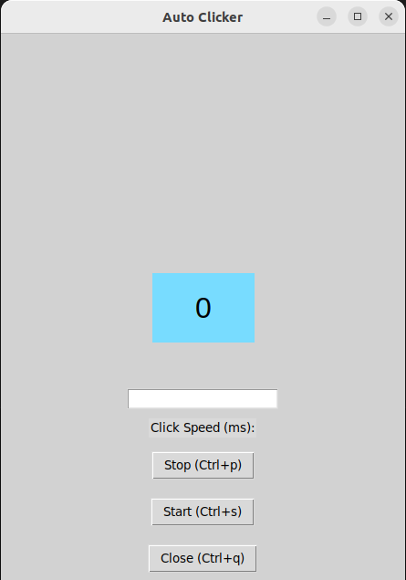

# Auto-Clicker

## Install requirements.txt
<pre>pip install -r requirment.txt</pre>
<pre>python3 frame.py</pre>
<pre>sudo apt install python-is-python3</pre> to make python3 as python
This project is about implementing an auto clicker

